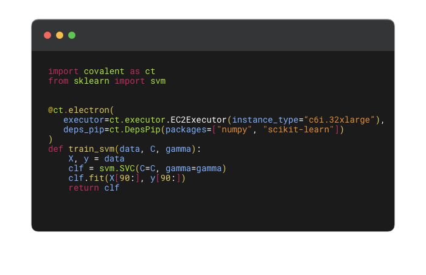

&nbsp;

<div align="center">


[](https://github.com/AgnostiqHQ/covalent)
[](https://www.gnu.org/licenses/agpl-3.0.en.html)

</div>

## Covalent AWS Plugins



[Covalent](https://github.com/AgnostiqHQ/covalent) is a python based workflow orchestration tool used to execute HPC and quantum tasks in heterogenous environments.

By installing Covalent AWS Plugins users can leverage a broad plugin ecosystem to execute tasks using AWS resources best fit for each task.

Covalent AWS Plugins installs a set of executor plugins that allow tasks to be run in an EC2 instance, AWS Lambda, AWS ECS Cluster, AWS Batch Compute Environment, and as an AWS Braket Job for tasks requiring Quantum devices.

If you're new to covalent visit our [Getting Started Guide](https://covalent.readthedocs.io/en/latest/getting_started/index.html).


## Installation

To use the AWS plugin ecosystem with Covalent, simply install it with `pip`:

```bash
pip install covalent-aws-plugins[all]
```

This will ensure that all the AWS executor plugins listed below are installed.

> You may require [Docker](https://docs.docker.com/get-docker/) and [Terraform](https://learn.hashicorp.com/tutorials/terraform/install-cli) to be installed to use the Braket & EC2 plugins respectively.

## Included Plugins

While each plugin can be installed separately, `covalent-aws-plugins` pip package will automatically download all of the plugins listed below.

| | Plugin Name | Use Case |
|---|-------------|-------------|
|| AWS Batch Executor |**Useful for heavy compute workloads (high CPU/memory).** Tasks are queued to execute in the user defined Batch compute environment.|
||AWS EC2 Executor|**General purpose compute workloads where users can select compute resources.** An EC2 instance is auto-provisioned using terraform with selected compute settings to execute tasks.|
||AWS Braket Executor|**Suitable for Quantum/Classical hybrid workflows.** Tasks are executed using a combination of classical and quantum devices.|
||AWS ECS Executor|**Useful for moderate to heavy workloads (low memory requirements).** Tasks are executed in an AWS ECS cluster as containers.|
||AWS Lambda Executor|**Suitable for short lived tasks that can be parallalized (low memory requirements).** Tasks are executed in serverless AWS Lambda functions.|

## Usage Example

- Firstly, import covalent.
```python
import covalent as ct
```
- Secondly, define your executor (expand any of the below plugins).

<details>
  <summary>AWS Batch Executor</summary>

   Read more about how to use this executor in our [docs](https://covalent.readthedocs.io/en/latest/api/executors/awsbatch.html#usage-example). Below are the basics of how it can be used.

```python
executor = ct.executor.AWSBatchExecutor(
    s3_bucket_name = "covalent-batch-qa-job-resources",
    batch_job_definition_name = "covalent-batch-qa-job-definition",
    batch_queue = "covalent-batch-qa-queue",
    batch_execution_role_name = "ecsTaskExecutionRole",
    batch_job_role_name = "covalent-batch-qa-job-role",
    batch_job_log_group_name = "covalent-batch-qa-log-group",
    vcpu = 2, # Number of vCPUs to allocate
    memory = 3.75, # Memory in GB to allocate
    time_limit = 300, # Time limit of job in seconds
)

```
</details>

<details>
  <summary>AWS EC2 Executor</summary>

   Read more about how to use this executor in our [docs](https://covalent.readthedocs.io/en/latest/api/executors/awsec2.html#usage-example). Below are the basics of how it can be used.

```python
executor = ct.executor.EC2Executor(
	instance_type="t2.micro",
	volume_size=8, #GiB
	ssh_key_file="~/.ssh/ec2_key"
)
```
</details>

<details>
  <summary>AWS Braket Executor</summary>

   Read more about how to use this executor in our [docs](https://covalent.readthedocs.io/en/latest/api/executors/awsbraket.html#usage-example). Below are the basics of how it can be used.

```python
executor = ct.executor.BraketExecutor(
    s3_bucket_name="braket_s3_bucket",
    ecr_repo_name="braket_ecr_repo",
    braket_job_execution_role_name="covalent-braket-iam-role",
    quantum_device="arn:aws:braket:::device/quantum-simulator/amazon/sv1",
    classical_device="ml.m5.large",
    storage=30,
)
```
</details>

<details>
  <summary>AWS ECS Executor</summary>

   Read more about how to use this executor in our [docs](https://covalent.readthedocs.io/en/latest/api/executors/awsecs.html#usage-example). Below are the basics of how it can be used.

```python
executor = ct.executor.ECSExecutor(
    s3_bucket_name="covalent-fargate-task-resources",
    ecr_repo_name="covalent-fargate-task-images",
    ecs_cluster_name="covalent-fargate-cluster",
    ecs_task_family_name="covalent-fargate-tasks",
    ecs_task_execution_role_name="ecsTaskExecutionRole",
    ecs_task_role_name="CovalentFargateTaskRole",
    ecs_task_subnet_id="subnet-000000e0",
    ecs_task_security_group_id="sg-0000000a",
    ecs_task_log_group_name="covalent-fargate-task-logs",
    vcpu=1,
    memory=2
)
```
</details>

<details>
  <summary>AWS Lambda Executor</summary>

   Read more about how to use this executor in our [docs](https://covalent.readthedocs.io/en/latest/api/executors/awslambda.html#usage-example). Below are the basics of how it can be used.

```python
executor = ct.executor.AWSLambdaExecutor(
    lambda_role_name="CovalentLambdaExecutionRole",
    s3_bucket_name="covalent-lambda-job-resources",
    timeout=60,
    memory_size=512
)
```
</details>


- Lastly, define a workflow to execute a particular task using one of the above executors

```python
@ct.electron(
    executor=executor
)
def compute_pi(n):
    # Leibniz formula for π
    return 4 * sum(1.0/(2*i + 1)*(-1)**i for i in range(n))

@ct.lattice
def workflow(n):
    return compute_pi(n)


dispatch_id = ct.dispatch(workflow)(100000000)
result = ct.get_result(dispatch_id=dispatch_id, wait=True)
print(result.result)

```

Which should output

```
3.141592643589326
```


## Release Notes

Release notes are available in the [Changelog](https://github.com/AgnostiqHQ/covalent-aws-plugins/blob/main/CHANGELOG.md).

## Citation

Please use the following citation in any publications:

> W. J. Cunningham, S. K. Radha, F. Hasan, J. Kanem, S. W. Neagle, and S. Sanand.
> *Covalent.* Zenodo, 2022. https://doi.org/10.5281/zenodo.5903364

## License

Covalent is licensed under the GNU Affero GPL 3.0 License. Covalent may be distributed under other licenses upon request. See the [LICENSE](https://github.com/AgnostiqHQ/covalent-braket-plugin/blob/main/LICENSE) file or contact the [support team](mailto:support@agnostiq.ai) for more details.
